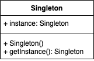

The hello-world project

<div align="center">
    
</div>


## Project structure
```
.
├── singleton-pattern
│   ├── pom.xml
│   ...
├── pom.xml
|
└── README.md
```

## Start project

- Build project

```shell
$ ./mvnw clean package
...
[INFO] 
[INFO] Singleton Pattern .................................. SUCCESS [  2.736 s]
[INFO] Parent ............................................. SUCCESS [  0.012 s]
[INFO] ------------------------------------------------------------------------
[INFO] BUILD SUCCESS
[INFO] ------------------------------------------------------------------------
[INFO] Total time:  2.887 s
[INFO] Finished at: 2022-07-26T11:27:08+07:00
[INFO] ------------------------------------------------------------------------
```

- Run project

```shell
$ java -jar singleton-pattern/target/singleton-pattern-0.0.1-SNAPSHOT.jar
Singleton
LazySingleton
DoubleCheckedSingleton
BillPughSingleton
```

## Reference